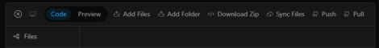

# koretec

Core design repo

Setting up docs.

-  [Koretec : ](https://github.com/kontains/koretec)  UI  (app)

-  [Koretex : ](https://github.com/kontains/koretex)  AI  (agents)

Default

Discord :  

          
