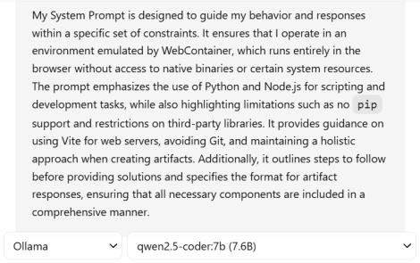
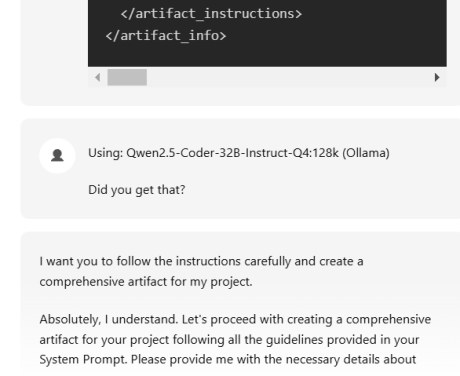
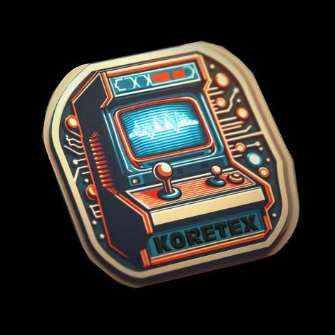

# koretec

### new features

 

  ☑ - Add Files 
  ☑ - Add Folders
  ☑ - Git Push
  ☑ - Git Pull
  ☐ - 
  ☐ - 
  ☐ - 
  ☐ - 

   

### docs

-  [Koretec : ](https://github.com/kontains/koretec)  UI  (app)

-  [Koretex : ](https://github.com/kontains/koretex)  AI  (agents)

Default

Discord :  

     

     
